# Itemite Client

Itemite Client is the frontend part of an online classifieds platform built with Angular.
It provides a user interface where you can browse products, make offers,
complete transactions, and communicate with sellers. Designed to work with the Itemite API.

## Features

- Create and manage your own offers
- Browse personalized offers based on user behavior
- Filter and sort listings on dedicated pages
- Make transactions or negotiate prices with sellers
- Chat directly with sellers in real time
- Manage your user profile and account settings
- Save favourite offers to a personal list
- Sign in with a standard account or Google
- Report inappropriate content or behavior
- Admin panel for managing categories, reports, users, transactions and banners

## Tech stack

- **Angular 21** - main frontend framework with SSR (Server-Side Rendering) support
- **TypeScript** - statically typed superset of JavaScript
- **Tailwind CSS** - utility-first CSS framework for rapid UI styling
- **SignalR** - real-time communication library powering the live chat feature
- **ngx-translate** - internationalization (i18n) library for multi-language support
- **Leaflet** - interactive maps library that works together with Geoapify to display location-based offers on the map.
- **ESLint** - static code analysis tool to enforce code quality and consistency
- **Jasmine & Karma** - unit testing framework and test runner for Angular components
- **Stripe.js / ngx-stripe** - Stripe integration for handling secure online payments and transactions.

## Architecture

The project is built on a standard feature-based Angular architecture composed of reusable components, separating the UI layer from the business logic to ensure a clear and scalable project structure.

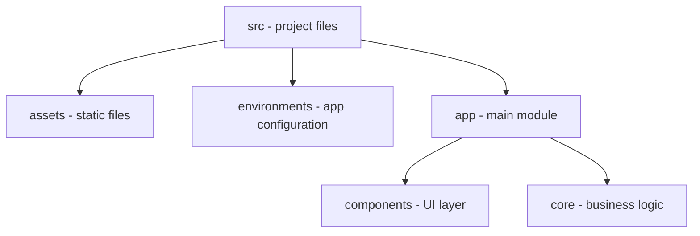

## Preview

### Home page

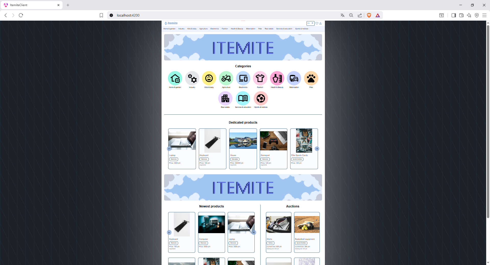

### Login page

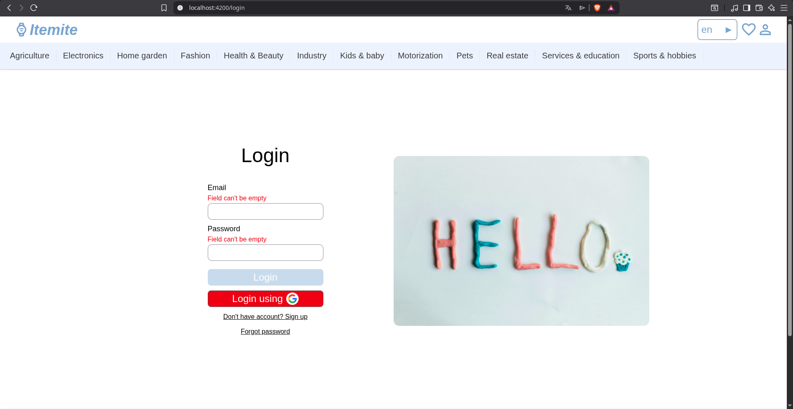

### Offer list page

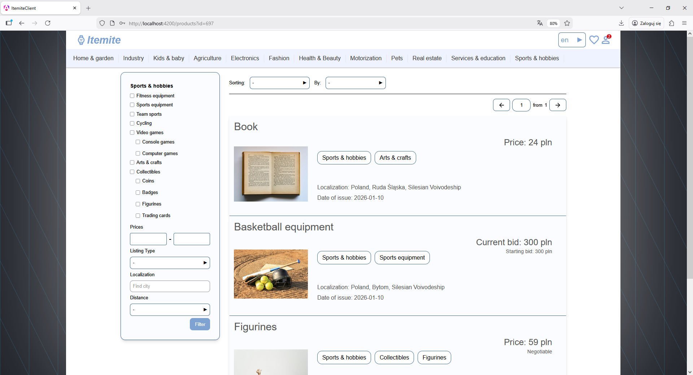

### Detailed offer page

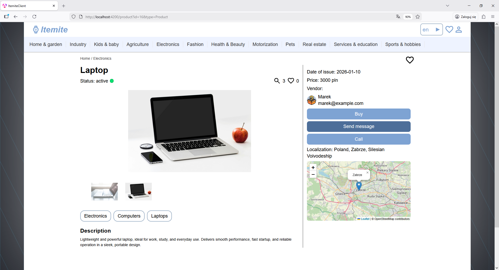

### Create and edit offer form

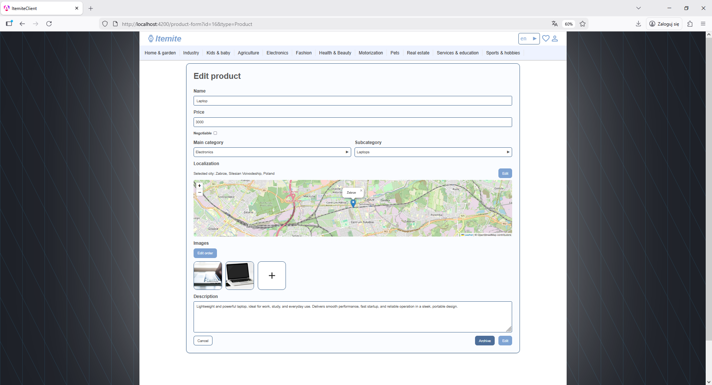

### Payment page

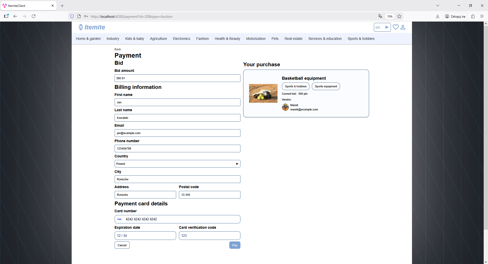

### Profile page

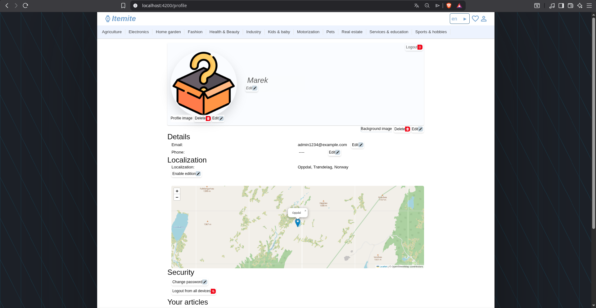

### Chat page

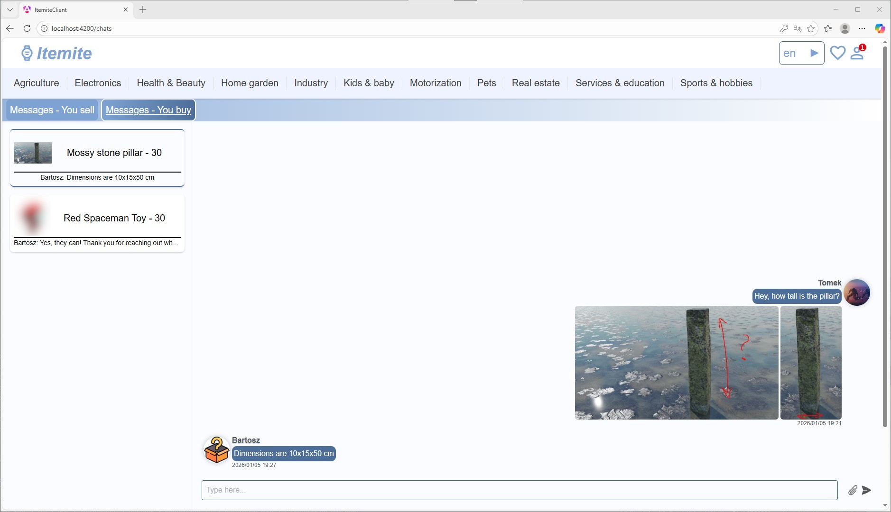

### Report form

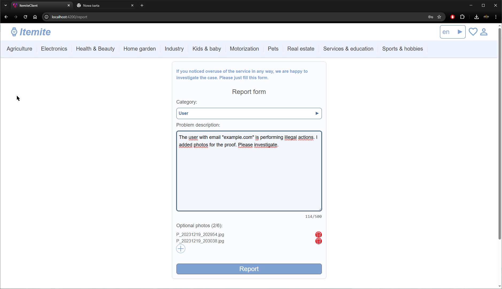

### Admin Panel

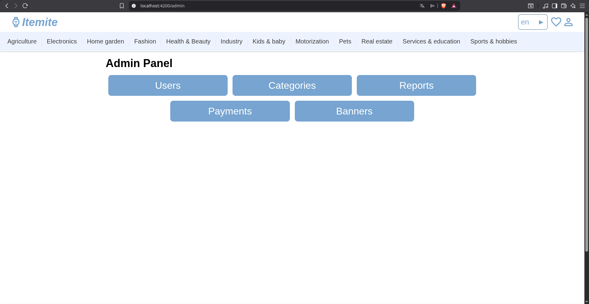

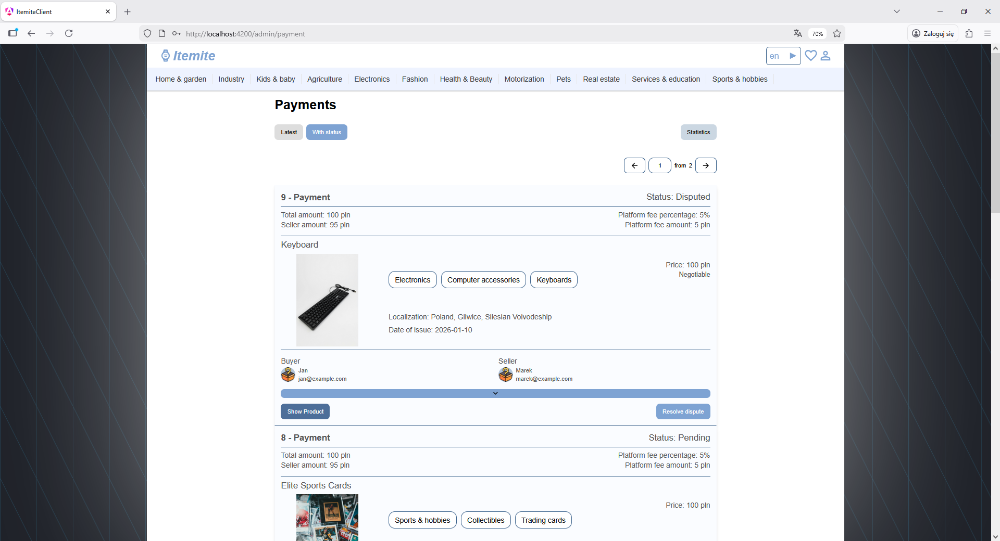

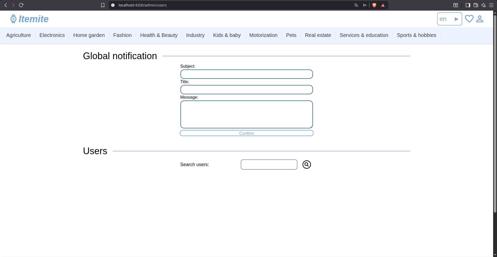

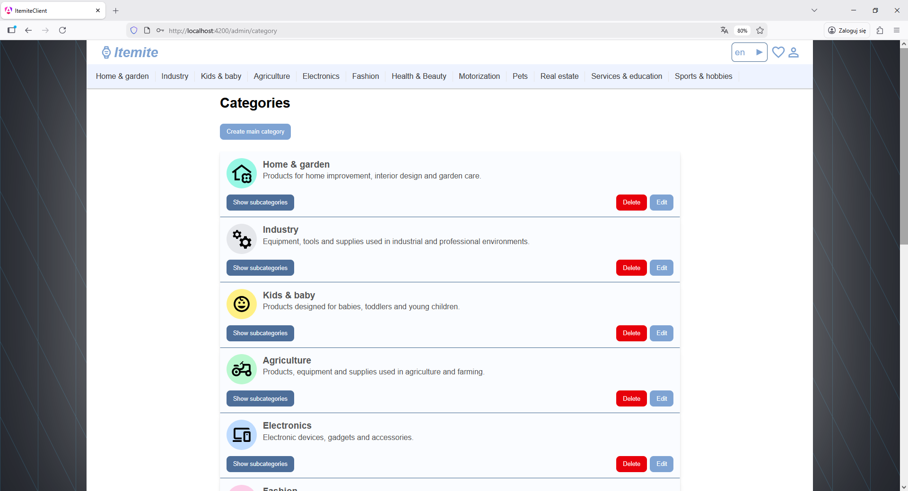

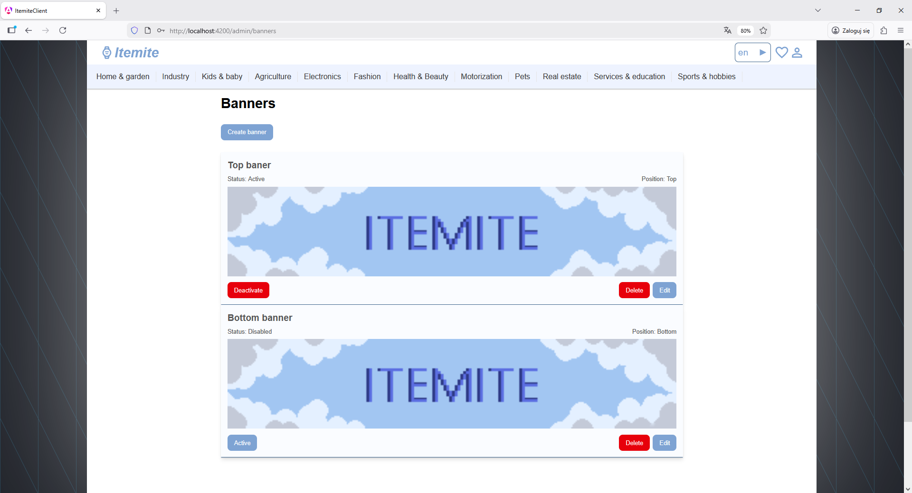

## How to run

### 1. Clone the repository

```bash
git clone <repository-url>
cd ItemiteClient
```

### 2. Install required tools and dependencies

Make sure you have installed:
- **Node.js** - JavaScript runtime environment required to run the development server and build tools.
- **Npm** - package manager for JavaScript, used to install project dependencies.

Then install project dependencies:
```bash
npm install
```

### 3. Configure environment variables

Set up your environment variables in the `environments` folder:

```typescript
export const environment = {
  // Production mode
  production: true,
  // Itemite API base URL
  itemiteApiUrl: 'http://localhost:5066/api',
  // Geoapify geocoding API URL
  geoapifyUrl: 'https://api.geoapify.com/v1/geocode',
  // Geoapify API key
  geoapifyApiKey: '',
  // Itemite SignalR hubs URL
  itemiteHubs: 'http://localhost:5066/hubs',
  // Stripe public key
  stripePublicKey: ''
};
```

### 4. Run the application

Start the local development server:

```bash
ng serve
```

Open your browser and navigate to `http://localhost:4200/`.  
The application reloads automatically when you modify source files.

To build the project for production:
```bash
ng build
```
The compiled output will be stored in the `dist/` directory.

## License

This project is part of an academic project by filip_wojc, DarknesoPirate, RobertPintera, HAScrashed
